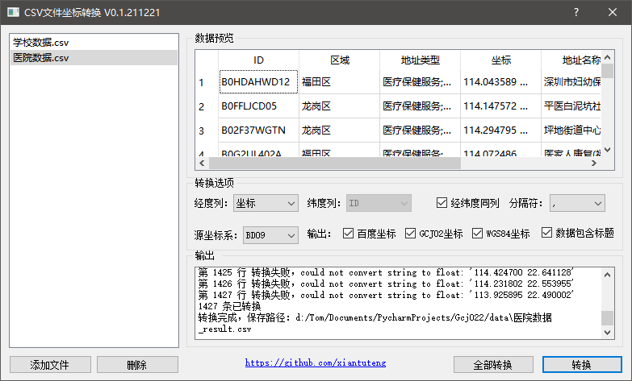

# CSV文件坐标转换

GCJ022是一个用于转换CSV文件中坐标的工具，能够将CSV文件中的BD09、GCJ02、WGS84等三种坐标相互转换。

## 特性
- 自动识别CSV文件编码，支持ASCII、GB2312、GBK、GB18030、UTF-8等编码。
- 支持CSV标题的识别与过滤
- 支持经纬度值在同一列和不同列，如果在同一列，则支持多种分隔符。
- 支持BD09、GCJ02、WGS84等三种坐标相互转换。
- 支持单个或批量CSV文件，遇错自动忽略并继续。

## 下载
- Windows:

[gcj022-win-v0.1.211221.exe](https://github.com/xiantuteng/gcj022/releases/download/v0.1/gcj022-v0.1.211221.exe)

- Linux:

[gcj022-linux-v0.1.211228](https://github.com/xiantuteng/gcj022/releases/download/v0.1/gcj022-linux-v0.1.211228)

说明：Linux环境下运行需要安装以下组件：
```commandline
sudo apt-get install libxcb-xinerama0
sudo apt-get install python3-opencv
```

## 依赖
- Python 3.8
- PyQt5
- pyqt5-tools
- chardet

## 运行与打包

### 编译Qt界面
GCJ022 使用了QtDesigner设计的.ui文件，在运行前先要将.ui文件编译为.py文件，执行 build-ui.bat文件或执行以下命令：
```buildoutcfg
python -m PyQt5.uic.pyuic main.ui -o UiMainDialog.py
```

### Ubuntu下依赖配置 
在Ubuntu环境下，执行会报如下错误：
```commandline
qt.qpa.plugin: Could not load the Qt platform plugin "xcb" in "" even though it was found.
This application failed to start because no Qt platform plugin could be initialized. Reinstalling the application may fix this problem.

Available platform plugins are: eglfs, linuxfb, minimal, minimalegl, offscreen, vnc, wayland-egl, wayland, wayland-xcomposite-egl, wayland-xcomposite-glx, webgl, xcb.
```
需要安装以下依赖库：
```commandline
sudo apt-get install libxcb-xinerama0
sudo apt-get install python3-opencv
pip uninstall opencv-python
pip install opencv-contrib-python
```

### 源码运行
使用Python可以直接运行
```buildoutcfg
python main.py
```
### 打包可执行文件
使用PyInstaller进行打包，首先安装PyInstall，再执行 build-exe.bat文件或执行对应命令：
```buildoutcfg
pip install pyinstaller
pyinstaller -F -w main.py
```

## 界面
主界面：

